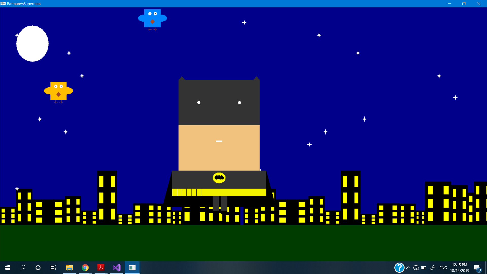

### This is Batman vs. Superman Game using openGL C++. 
## To play :
* just mouse-left click and hold it to control the power . 
* The player who gets the first 5 shots is the winner . 
## To run it :
## in linux or windows you have to configure glut lib in the OS and run it whether in VScode or visual studio or any other IDE

