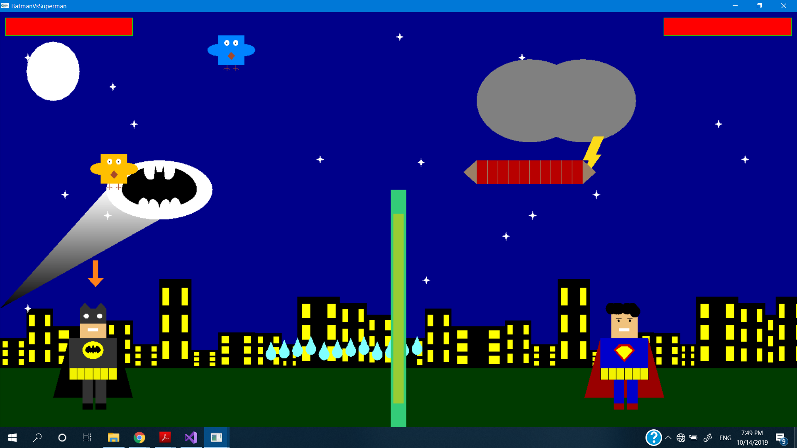
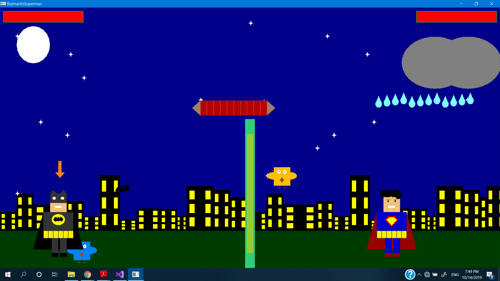
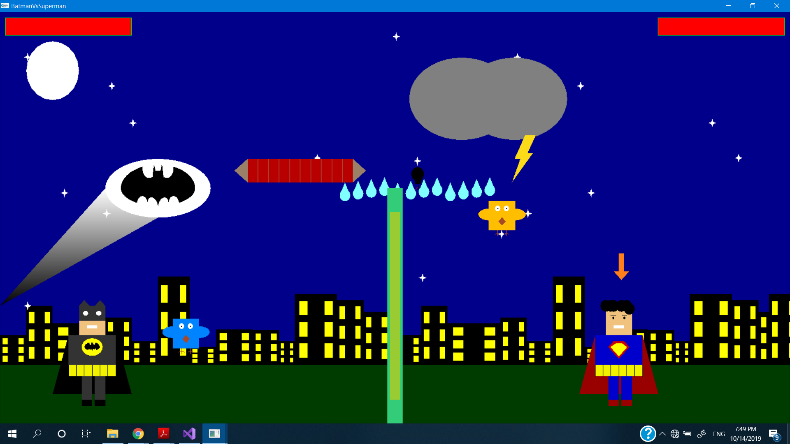
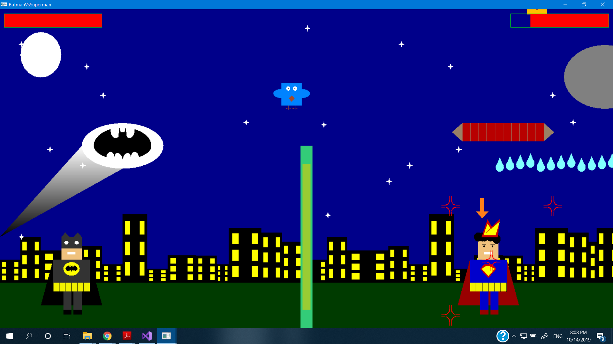

### This is Batman vs. Superman Game using openGL C++. 
## To play :
* just mouse-left click and hold it to control the power . 
* The player who gets the first 5 shots is the winner . 
## To run it :
1)use visual studio by opening openGL2DTemplate.sln and then run . 
2)use any other IDE (VScode or atom ..) but you must first handle the openGL libs paths .

